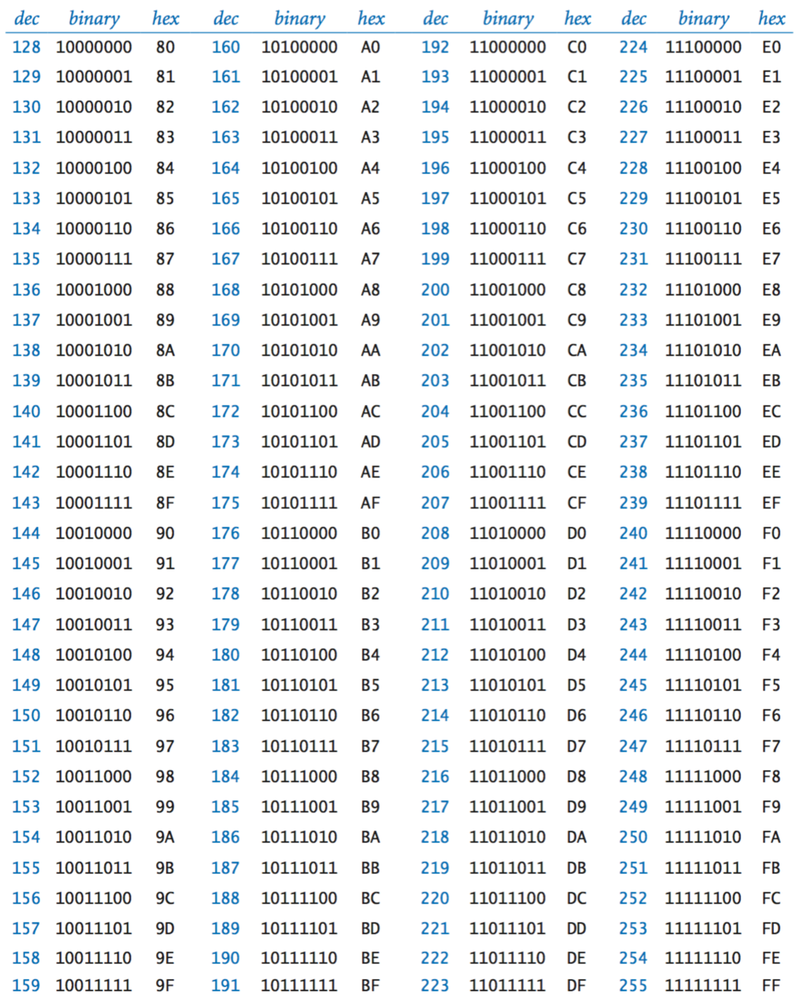

# 3/4 Stack dApp Development: A Crash Course

For the King's College London Starter Weekend Entrepreneurship Conference, 2 - 3 March 2019, John IV and Yakko Majuri will present and curate a hands on workshop: a crash course in dApp development in Solidity and web3.js. We will go over the basic concepts of blockchain and smart contracts, and walk through the process of deploying and interacting with a contract on an Ethereum testnet from your laptop. Basic knowledge of the command line, github and JavaScript would be helpful, but are not required. If you’d like to code please bring a laptop with node, npm and a text editor installed.

We will introduce key concepts of cryptography and distributed ledgers before installing truffle and creating (or cloning) a contract repository. We’ll develop and test a basic Solidity contract on our local machines, then deploy them to a testnet.

Ideally we would also create a simple HTML interface that would allow us to read and invoke functions on the blockchain by configuring web3.js. This would exhibit a near-full stack dApp (minus ipfs) to workshoppers.


# Introduction

## Data and Information

Data is a sequence of symbols in a particular order. Information is the *meaning* contained within data, as perceived by someone receiving the data.

For this workshop we will be focusing on binary data, in which the "symbols" ("radices" in numeral systems, plural for "radix") are bits, represented as 0s and 1s. Binary is really a way of representing numbers - in base 2 there are only two "radix", or unique symbols representing digits, in the numeral system. Base 10 (decimal or denary) has 10 radices: 0, 1, 2, 3, 4, 5, 6, 7, 8, 9; Base 16 has 16: 0, 1,2, 3, 4, 5, 6, 7, 8, 9, A, B, C, D, E, F and so on. We use base 10 because it is familiar to us and Base 16 because it is easier for both us and computers to interpret, but all data a computer ever encounters is binary.

**Binary, Decimal and Hexadecimal Numbers**



*A table showing corresponding decimal, binary and hexadecimal numbers from 0 to 256, from [Representing Information, Princeton](https://introcs.cs.princeton.edu/java/61data/).*

Bytes and Bits

Bytes are sequences of 8 bits, meaning there are 256 different bytes in binary. Each byte is a number between (in base 10) 0 and 255: 00000000 to 11111111.

Binary addition

  00000000  (0)
+ 00000001  (1)
  /-------
  00000001  (1)
+ 00000001  (1)
  /-------
  00000010  (2)

Examples of binary data:
- Random noise : 10011011 01100100 00001010 01010100 00010001 00110011 (from [random.org](https://www.random.org/cgi-bin/randbyte?nbytes=10&format=b))
- Uniform distribution : 10001000 10001000 10001000 10001000 10001000 .....
- UTF-8 : 00110010 00110000 00110001 00111001 (from [onlineutf8tools.com](https://onlineutf8tools.com/convert-utf8-to-binary))
- JPG : a 3-dimensional array containing 3 numbers for each pixel, representing Red, Green and Blue values.
- MP3 : somehow a binary stream can be converted into output to a speaker ... don't ask me how (yet ...)

These sequences of bits - if interpreted by a processor running the right software - contain all the information we can access through a computer. This is done by *encoding* the information into a binary form. An encoding simply is a standardized way to organize bits so a computer running software programmed to interpret that encoding can decode the information, and handle it appropriately. Note that many encodings exist, often for the same symbols: UTF-8, UTF-16, ASCII, etc.

Software is designed to process data according to these encoding specifications. In most encodings specific bytes, or sequences of bytes, mean different things. For example, the table below shows the meaning of different bytes in the UTF-8 encoding (here represented in hexademical numbers, prefixed by 0x - which just indicates to the computer that the subsequent symbols should be interpreted as digits in a hexademical number. We'll see this more when we get into Ethereum ...). More on encoding [here](http://kunststube.net/encoding/).

**Common JPG markers (from [wikipedia](https://en.wikipedia.org/wiki/JPEG))**


And, more relevant for our work with smart contracts, UTF-8 encodings (from [Science Friday](https://www.sciencefriday.com/educational-resources/write-your-name-in-binary-code/)):


### Transfer and Storage

So, information is encoded into binary data and computers can process that data if they are installed with the right software (software programmed to interpret that encoding). How does a computer actually receive the data, and process it?

While obviously this is hugely complex, the basics are quite simple. Data can be stored in a persistent state - on a disk - or encoded into a signal that can be transmitted. We can think of this as data moving through time (on disk) or through space. In this way, data (and therefore the information it encodes) can be stored for retrieval and processing later, or transmitted to another computer for processing.

#### Transfer

Data is moved - from sources of input (typically sensors, disks or other computers) through a processor to destinations of output (disks, monitors, speakers, or another computer) - by modulating the characteristics of some signal. This signal is usually either an electrical current or a beam of electromagnetic radiation - light - at a specific frequency.

#### Storage

How hard drives work is a bit beyond the scope of this workshop, but binary data can be stored in a persistent state by applying an electrical current which carries the bit sequence to an array of floating-gate transistors, which store the information in a way that it can be accessed in the future by passing an electrical current through the device.

And that's about it. Bitstreams come into a processor on an electrical current, the CPU processes them according to functions (AKA algorithms) that are stored in an easily accessible place - RAM - and outputs whatever data is returned from the function to wherever it is meant to go. By linking these steps together - and performing them millions or billions of times per second - computers process data and do everything we use them for, from sending messages to streaming video and so on.

## Cryptography

> cryptography: the art of writing or solving codes
>  [Google's Dictionary](https://www.google.com/search?client=firefox-b-d&q=Dictionary#dobs=cryptography)

Cryptography is the process of manipulating data such that the information it represents can be understood by some and not others. "Some and not others" implies authorization: in a cryptographic system, the creator and encrypter of data wants to be able to provide to the information - meaning - contained in the data to certain people (or computers - together, "agents"). Further, cryptographic algorithms designed to essentially map data of arbitrary length (like any file) to a fixed-length, near-unique datum help communicating agents ensure that they are looking at the exact same data. These are called hashing algorithms.

### Agents

Just to define terms, in a cryptosystem there are typically three types agents considered: a message **sender**, a message **recipient**, and essentially everyone else, including people for whom the message is not intended, but want to access the information contained (known as **attackers**). Typically it is assumed that attackers know which algorithms were used to encrypt a message, massively increasing the ability to try to hack the message (Kerckhoff's principle). Further, on the internet any message that leaves a sender's local machine should be assumed to be visible to anyone.

### Ciphers and Hashing Functions

"In cryptography, a cipher (or cypher) is an algorithm for performing encryption or decryption" [wikipedia](https://en.wikipedia.org/wiki/Cipher). These algorithms usually depend on a **key** which, when passed in with the unencrypted message (**plaintext**), outputs a **ciphertext**, or encrypted message. Passing that ciphertext into a decryption algorithm with the appropriate key (which is sometimes the same as the encryption key - symmetric-key ciphers - and sometimes different - asymmetric key ciphers).

Ciphers accept a key and a plaintext and output a ciphertext message that can be converted back to the plaintext with the right key. Hashing algorithms simply accept a piece of data and output a **hash**, which can be thought of as a standard length of data *unique to the input data*. Note that it is not exactly unique - there are infinite possible inputs and a finite number of possible outputs, so sometimes different inputs produce the same output. This is called a "collision".

To demostrate these algorithms, we will look at the AES symmetric-key cipher, the secp256k1 asymmetric cipher and the Keccak cryptographic hashing function in NodeJS:

First, create a node project and install the modules on the command line:

```bash
~ : mkdir cryptography-playground && cd cryptography-playground
~ : npm init
... go through package.json setup
~ : npm install aes-js
~ : node # To enter Node's interactive shell - from here, we write javascript

  # This demonstration can be found on the aes-js github, https://github.com/ricmoo/aes-js#readme
  > var aesjs = require('aes-js');
  > var key = [ 1, 2, 3, 4, 5, 6, 7, 8, 9, 10, 11, 12, 13, 14, 15, 16 ];
    # Note: this is a terrible key. It is just for practice - usually we would
    # create a secure random key. Also, most cipher algorithms require keys to
    # be of a certain length, and in a certain encoding.
  > var text = "To be or not to be?";
  > var textBytes = aesjs.utils.utf8.toBytes(text);
    # Here we get an array of bytes, which matches the length of the message:
    # one byte per character.
  > console.log(text.length == textBytes.length);
    true
  > var aesCtr = new aesjs.ModeOfOperation.ctr(key, new aesjs.Counter(5));
  > var encryptedBytes = aesCtr.encrypt(textBytes);
  # To print or store the binary data, you may convert it to hex
  > var encryptedHex = aesjs.utils.hex.fromBytes(encryptedBytes);
  > console.log(encryptedHex);
  # a332b5b5c203d68fb6159b0492755f988290a4
  # Note that this number ^ is 38 characters long ... twice the length of our
  # plaintext. That is because each byte (character) is 2 hex digits, and the
  # ciphertext is the same length as the plaintext ...
  # Converting it to hex allows us to store and transmit the message easily.
  > var encryptedBytes = aesjs.utils.hex.toBytes(encryptedHex);
  # this will be the same as above, but often takes place on another computer
  > var aesCtr = new aesjs.ModeOfOperation.ctr(key, new aesjs.Counter(5));
  # Since this is a symmetric key cipher, the same key will be used to decrypt
  # the message.
  > var decryptedBytes = aesCtr.decrypt(encryptedBytes);
  > var decryptedText = aesjs.utils.utf8.fromBytes(decryptedBytes);
  > console.log(decryptedText);
  # "To be or not to be?"
```

Next let's look at a popular asymmetric cipher developed for the bitcoin blockchain, but used in the Ethereum specification as well: secp256k1.


### The CIA Triad [1](https://www.techrepublic.com/blog/it-security/the-cia-triad/)

**Confidentiality**

Only authorized
